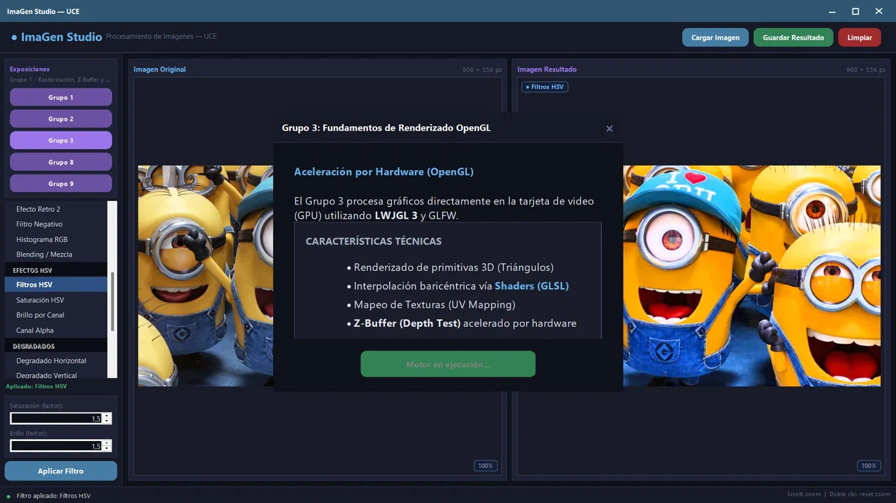

<div align="center">
  <h1>🎨 ImaGen Studio</h1>
  <p><i>Un motor avanzado de procesamiento de imágenes y renderizado gráfico interactivo.</i></p>
  
  
  
  
  
  
  <br><br>
  
</div>

---

## 📖 Acerca del Proyecto

**ImaGen Studio** es una potente aplicación gráfica de escritorio que integra procesamiento digital de imágenes por CPU (manipulación a nivel de píxel) con aceleración por hardware vía GPU (OpenGL). Construido sobre **Java Swing** y **LWJGL 3**, este sistema sirve como un laboratorio interactivo para visualizar algoritmos clásicos de computación gráfica, desde operaciones raster hasta proyecciones tridimensionales complejas.

El proyecto destaca por tener una arquitectura asíncrona que evita bloqueos en la interfaz (mediante `SwingWorker`), uso de *Direct Memory Access* (accediendo a punteros vía `DataBufferInt`) para un rendimiento de procesado en tiempo real, y una UI moderna, responsiva y altamente estilizada.

---

## ✨ Características Principales

### 🖥️ Procesamiento Digital de Imágenes (CPU)
- **Rasterización Avanzada:** Implementación manual de algoritmos de dibujado de primitivas.
- **Mapeo de Texturas (Grupo 2):** Aplicación interactiva de texturas sobre polígonos generados dinámicamente con vistas "Split-Screen" (Imagen Original vs. Render de Textura).
- **Algoritmos de Fragmentos (Grupo 8):**
  - **Efecto Stencil Interactivo:** Recorte dinámico de máscara circular con radio ajustable mediante *sliders* asíncronos.
  - **Operación Lógica XOR:** Combinación matemática a nivel de bits entre múltiples canales de color.
  - **Interpolación Blending:** Suavizado de bordes e interpolación dinámica de píxeles.

### 🚀 Renderizado 3D y Aceleración por Hardware (GPU)
- **Motor LWJGL 3 Independiente (Grupo 3):** Contexto OpenGL nativo aislado mediante GLFW, sin afectar el hilo de UI de Java.
- **Interpolación Baricéntrica (Shaders):** Uso de GLSL (Vertex y Fragment shaders) para calcular gradientes de color precisos por hardware.
- **Z-Buffer y Depth Testing:** Demostración gráfica e interactiva de la prevención de anomalías visuales (Algoritmo del Pintor vs. Profundidad real Z-Buffer).
- **HUD (Heads-Up Display):** Inyección de estado y telemetría sobre los gráficos 3D en tiempo real renderizando quads mediante el pipeline gráfico.

### 🎨 Arquitectura de Experiencia de Usuario (UI/UX)
- **Diseño "Dark Mode" Premium:** Esquema de colores construido desde cero (sin depender del L&F nativo), con acentos en cyan, paneles translúcidos y micro-interacciones (hover en botones).
- **Feedback Asíncrono Multihilo:** Uso estricto del *Event Dispatch Thread (EDT)* para mantener la interfaz fluida, con indicadores visuales de "Motor en ejecución".
- **Sistema de Diálogos Embebidos y Flotantes:** Menús laterales colapsables, layouts fluidos (`BorderLayout` / `CardLayout`) y pantallas de información en formato de tarjetas de presentación enriquecidas.

---

## ⚙️ Especificaciones Técnicas

- **Lenguaje Base:** Java 17+
- **Framework de Interfaz:** Java AWT / javax.swing
- **Gestión de Dependencias:** Apache Maven
- **Librerías Core:** 
  - `org.lwjgl` (GLFW, OpenGL, STB)
  - `org.joml` (Java OpenGL Math Library)
- **Técnica de Rendimiento:** Modificación plana y lineal de memoria (`int[]` vía `Raster`) en lugar del lento acercamiento iterativo 2D tradicional.

---

## 🚀 Instrucciones de Despliegue

1. Clona este repositorio o descarga el código fuente.
2. Verifica tu entorno: **JDK 17** (mínimo) y **Maven**.
3. Actualiza el árbol de dependencias desde tu IDE (VS Code, IntelliJ, Eclipse) o en tu terminal:
   ```bash
   mvn clean install
   ```
4. Lanza la aplicación ejecutando la clase base de la ventana principal:
   `src/efectos/Main.java`

---

## 👥 Información Académica

Este proyecto fue concebido, unificado y desarrollado como parte de las prácticas y requerimientos de la asignatura de **Taller II**.

- **Nombre del Software:** ImaGen Studio
- **Grupo Asignado:** Grupo 2
- **Integrantes (Autores del Merge y UI/UX):** 
  - 👨‍💻 Borja Diego
  - 👩‍💻 Gonzalez Marielena
  - 👨‍💻 Jami Mateo
- **Docente Director:** Ing. Wladimir Carrillo

<br>
<div align="center">
  <sub>Construido con ingeniería de detalle para dominar la computación gráfica 🚀</sub>
</div>
